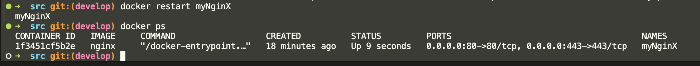
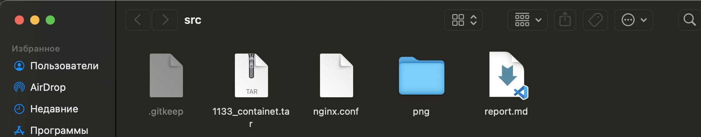

# Part 1

`docker pull nginx`

* Эта команда загрузит последний доступный образ Nginx из Docker Hub. Если вы хотите загрузить конкретную версию, вы можете указать её, добавив тег. Например, для версии 1.21 вы можете использовать:

`docker pull nginx:1.21`

`docker images`

* покажет список всех загруженныйх образов

* Запусти докер-образ через `docker run -d [image_id|repository]`

`docker run -d nginx`

* Проверь, что образ запустился через docker ps

* Посмотри информацию о контейнере через docker inspect [container_id|container_name]

* Размер контейнера можно определить по объединению всех слоев в GraphDriver.Data.LowerDir. В данном случае это не указано явно, но известно, что контейнер использует драйвер overlay2 с множеством слоев, которые указаны в поле LowerDir. В данном случае нет информации о размерах слоёв исходя из команды docker inspect .. ..

`shmsize`  нужный размер

* В поле ExposedPorts указаны порты, которые контейнер выставляет наружу:

`80/tcp`

* В поле IPAddress контейнера указано, что контейнер имеет IP-адрес

* остановка и проверка чтто конецйнер

поднятие контейнеера на портах 80, 443

* Перезапусти докер контейнер через docker restart [container_id|container_name].

# Part 2

* Прочитай конфигурационный файл nginx.conf внутри докер контейнера через команду exec.

* Скопируй созданный файл nginx.conf внутрь докер-образа через команду docker cp.

* Перезапусти nginx внутри докер-образа через команду exec

* Проверь, что по адресу localhost:80/status отдается страничка со статусом сервера nginx.

* Экспортируй контейнер в файл container.tar через команду export.

* Останови контейнер.

* Удали образ через docker rmi [image_id|repository], не удаляя перед этим контейнеры.

* Импортируй контейнер обратно через команду import

* Проверь, что по адресу localhost:80/status отдается страничка со статусом сервера nginx.

# Patr 3

* скачал библиотеку для поднятиля локал. сервера, инструкция в readme

    <https://github.com/toshic/libfcgi>

* поднимаем контейнер nginx на портах 81, перенорсим конф. файл и сервер на машину в докере

* для удобства переиминовал

* подключился к машине, прежде перенес все файлы из /part3/* на машину

# Part 4

* напиисал свой докер файл, скипт по запуску и nginx.conf из part3

nging.conf осттался тот же

    docker build -t part4 .

команда для сбора образа по `dockerfile`

* проверяем через `docker images`

* все есть, запускаем с маппингом 81 порта на 80 на локальной машине

# Part 5

* требуется прверить Docker образ на безопасность при помощи `dockle`

* 2 скрина, один с ошибкой, другой с ее исправлением.
это ошибка которую не исправить.

# Part 6

изменяем файлы согласно тз, так чтобы на loaclhost был развернут наш сайт

командой `docker-compose up --build` можно собрать и сразу запустить

все успешно собралось и запустилось

Вывод localhost

